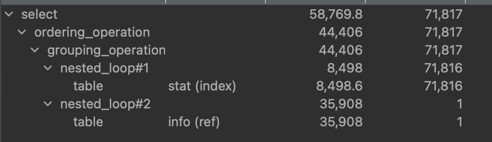

### MySQL Execute plain
- 🧐 여러개의 테이블에 각각 다른 where 조건을 적용해서 결과를 한번에 가져와야 하는 job 이 필요한데, 뭐가 더 효율이 좋을지에 대한 고민

#### 📊 성능 비교표
| 방법                | 성능     | 적합한 상황                                 |
|---------------------|----------|---------------------------------------------|
| CASE WHEN           | ⭐⭐⭐     | 대부분의 경우 (단일 스캔 + 인덱스)          |
| UNION ALL           | ⭐⭐      | 조건이 상호배타적일 때                      |
| JOIN + 파생 테이블  | ⭐       | 소량 데이터 + 복잡한 조건 분리 필요 시      |

---

#### 🚀 최적화 핵심 원칙
1. **CASE WHEN 우선**: 단일 쿼리로 처리해 테이블 접근 횟수 최소화
2. **암시적 조인 금지**: 반드시 `JOIN ... ON`으로 명시적 조인 조건 추가
3. **실행 계획 확인**: `EXPLAIN`으로 Full Scan 여부 점검
4. **Index**: 인덱스가 잡혀있을 경우 활용

---

#### Execution Plan

분석
- nested_roop 두번 (stat table, left join info table) `📌 중첩 루프 조인`
- stat : main 테이블로써 `range` 방식
- info : left join sub 테이블로써 `ref` 방식 (on 조건절)

사진 실행계획 해석
- stat (range): `stat` 테이블은 `range` 인덱스를 사용하여 71816 건을 읽음.
- info (ref): `info` 테이블은 `ref` 인덱스를 사용하여 각 stat의 행마다 1건씩, 총 35908 건을 읽음.
- Cost: 각 단계의 비용이 누적되어 최종적으로 58769.8 의 비용이 산출됨.
- ordering_operation, grouping_operation: 결과 집합을 정렬, 그룹화하는 연산이 추가로 발생.

효율이 좋은지 판단하는 기준
- 내부 테이블(여기선 info)이 ref 방식으로 인덱스를 타고 있음 → 효율이 좋은 편.
- 외부 테이블(stat)이 range로 접근 → 인덱스 범위 검색이므로 풀스캔보다 훨씬 효율적임.

`ℹ️ Nested Loop Join`
- 외부 테이블의 각 행마다 내부 테이블을 반복적으로 조회
- 내부 테이블에 인덱스가 있을 경우 해당 인덱스 태움
- 없으면 내부 테이블 풀스캔함

`ref`
- 인덱스가 적용된 컬럼에 equal 조건이 적용될 경우
- PK가 아니거나 unique가 아닌 인덱스에서 주로 적용됨

`range`
- 특정 범위에 해당하는 경우

---

튜닝 해야하는 조건 : ALL 또는 full scan 이 발생할 경우 인덱스를 활용하지 못한단 뜻이므로 튜닝 고려해야함