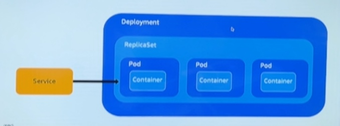

## Container, Docker and Kubernetes
컨테이너 : application 구동 환경까지 세팅해서 실행시킬 수 있는 격리기술. 개발자가 작성한 코드, application, 라이브러리 등을 모아 image로 변경해서 복제할 수 있음.

컨테이너 런타임 : 컨테이너를 다루기 위한 도구

오케스트레이션 : 여러 서버에 걸친 컨테이너와 사용하는 환경 설정을 관리하는 것

쿠버네티스란 컨테이너 런타임을 통해 컨테이너를 통제하는 도구라고 정의 하면 될듯.

도커랑 자주 비교되긴 하지만 도커 또한 컨테이너를 다루는 컨테이너 런타임의 한 종류이지, 쿠버네티스가 도커를 다루는 것은 아님.

### 가상머신과 컨테이너의 차이
가상머신은 CPU, Memory, 저장공간, OS 등 컴퓨터에 필요한 모든 항목들을 개별적으로 할당 하는 것이기 때문에 무거운 편임.
컨테이너는 한 컴퓨터 내의 CPU, OS 등을 공통적으로 쓰되 라이브러리, bin 설정 등에서 독립적으로 세팅할 수 있음.

## AWS EKS & ECS
EKS : k8s

ECS : Container

## AWS ECR
컨테이너, 이미지를 관리하는 레퍼지토리

Fargate(serverless), EC2(cloud), External(on-premiss) 등 클러스터를 활용해 ECR에 수정된 이미지를 자동으로 ECS, EKS에 배포할수도 있음

### EKS 들어가기 전 쿠버네티스 오브젝트 용어 정리
1. Pod(파드) 
- 쿠버네티스에서 생성하고 관리할 수 있는 배포 가능한 작은 컴퓨터 단위
- 한 파드 안에 컨테이너가 꼭 한개만 들어가야 한다는 법은 없음
2. ReplicaSet(레플리카셋)
- 파드 집합을 상시, 그리고 안정적으로 유지할수 있도록 함.
- n중화라고 생각하면 편할듯. 레플리카셋을 지정하면 지정한 개수 만큼 파드의 실행을 유지함 (ex. 3개일 경우 3개의 파드가 상시 실행됨)
- 파드를 삭제하더라도 레플리카셋이 설정되어 있다면 레플리카셋에서 자동으로 파드를 생성함
3. Deployment(디플로이먼트)
- 파드와 레플리카셋에 대한 선언적 업데이트 제공
- 보통 디플로이먼트를 통해 파드와 레플리카셋을 동시에 관리하는 편임
4. Service(서비스)
- 파드 집합에서 실행중인 애플리케이션을 네트워크 서비스로 노출하는 추상화 방법

파드, 레플리카셋, 디플로이먼트, 서비스 4가지의 관계를 이미지로 표현하자면

서비스는 디플로이먼트를 외부와 연결시켜주는 역할을 담당하고, 디플로이먼트는 레플리카셋과 파드를 관리하는 것이라고 생각하면 될듯.

EKS 실습
- https://catalog.us-east-1.prod.workshops.aws/workshops/46236689-b414-4db8-b5fc-8d2954f2d94a/ko-KR
- Cloud9 환경에서 EKS 설치 ~~....aws cli에선 설치 못하나? 🤔~~
- pod 생성 -> replicaset 생성 및 반영 -> deploymeny 생성 및 반영 -> service 생성 및 반영
