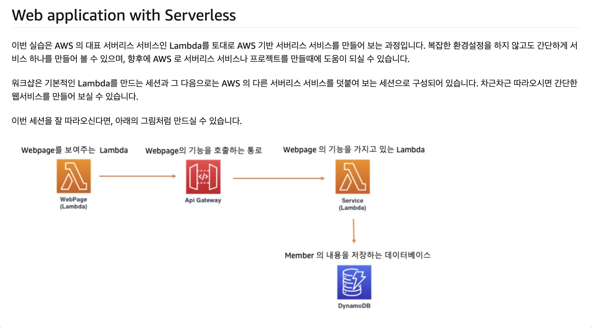

## Web Application With Serverless
배포 환경의 패러다임 전환

하드웨어 -> 가상머신(VM) -> Container -> Serverless

Serverless 환경 : 지속적 스케일링, 빌트인 된 내결함성, 사용한 만큼 과금, 서버 유지보수 없음(비즈니스 가치에만 집중함)

### AWS Lambda
aws에서 제공하는 서버리스 서비스

trigger(event) 기준으로 발생 : 데이터 상태 변화, 엔드포인트 요청, 리소스 상태 변화 등 구현 가능

### AWS API Gateway
종류 상관없이 rest(http, rest apis), websocket을 생성하는 서비스 (트래픽 관리, 권한 부여)

외부(다른 cloud, 또는 on-promise 등)에서 람다 함수를 호출하려면 API Gateway를 통해 호출 가능

### AWS DynamoDB
aws에서 제공하는 serverless Key-Value NoSQL DB

primary key : 1st - partition Key, 2nd - sort key(지정 안해도 상관 없음)

~~PK는 반드시 지정해야 하고, SK는 상황에 따라 지정해도 되고 지정하지 않아도 문제 없음. 말 그대로 정렬 기준이기 때문임~~

secondery key : GSI (Global)

실습 URL : https://catalog.us-east-1.prod.workshops.aws/workshops/600420b7-5c4c-498f-9b80-bc7798963ba3/ko-KR

